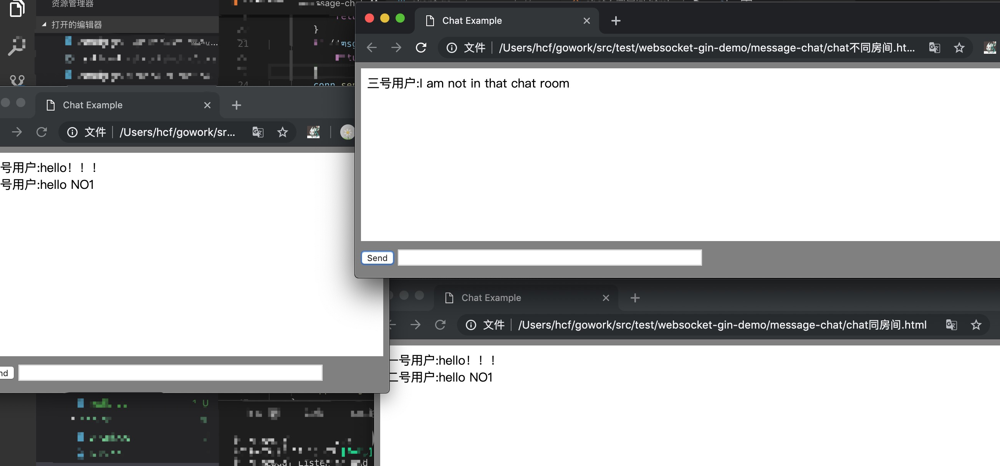

#GIN+Websocket Multiplayer, multiple chat rooms - demo（GIN+Websocket 多人,多个聊天室-demo）


##中文
改变程序内的import包，为自己的目录结构。  
运行 
```
go run main.go
```
启动后台websocket服务  
依次打开  
**First room.html**  
**Same room.html**  
**Different room.html**  

模拟3个用户，进行聊天室聊天  
如图


##English


Change the import package inside the program to its own directory structure.  
Run
```
go run main.go
```

Start the background websocket service  
Open sequentially  
**First room.html**  
**Same room.html**  
**Different room.html**  

Simulate 3 users and chat in a chat room
